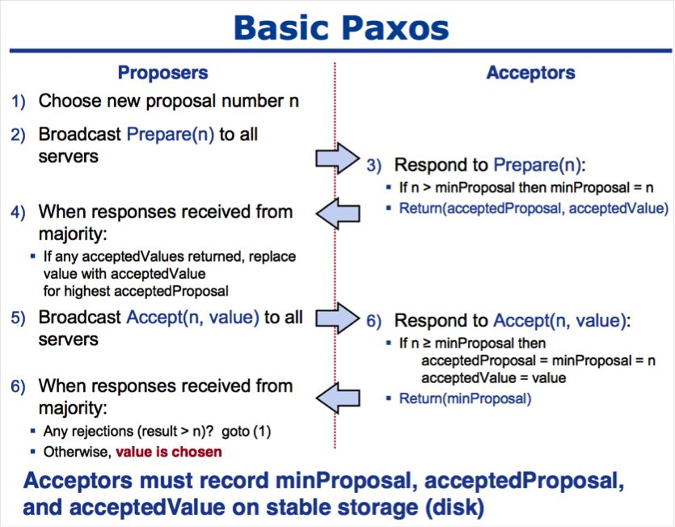

# Paxos 笔记

## Basic-Paxos

参考文章：

+ [Paxos算法详解 作者：祥光](https://zhuanlan.zhihu.com/p/31780743)
+ [paxos made simple译文 作者：张营](https://ying-zhang.github.io/dist/2001-paxos_made_simple-cn/)
+ [PAXOS Paxos Made Simp阅读笔记 作者：不想说](https://zhuanlan.zhihu.com/p/258929773)
+ [[Paxos三部曲之一] 使用Basic-Paxos协议的日志同步与恢复 作者：郁白](http://oceanbase.org.cn/?p=90)

Paxos算法通过一个决议分为两个阶段（Learn阶段之前决议已经形成）：

+ 第一阶段：Prepare阶段。Proposer向Acceptors发出Prepare请求，Acceptors针对收到的Prepare请求进行Promise承诺。
+ 第二阶段：Accept阶段。Proposer收到多数Acceptors承诺的Promise后，向Acceptors发出Propose请求，Acceptors针对收到的Propose请求进行Accept处理。
+ 第三阶段：Learn阶段。Proposer在收到多数Acceptors的Accept之后，标志着本次Accept成功，决议形成，将形成的决议发送给所有Learners。

Paxos算法流程中的每条消息描述如下：

**Prepare**: Proposer生成全局唯一且递增的Proposal ID (可使用时间戳加Server ID)，向所有Acceptors发送Prepare请求，这里无需携带提案内容，只携带Proposal ID即可。
**Promise**: Acceptors收到Prepare请求后，做出“两个承诺，一个应答”。
两个承诺：

1. 不再接受Proposal ID小于等于（注意：这里是<= ）当前请求的Prepare请求。

2. 不再接受Proposal ID小于（注意：这里是< ）当前请求的Propose请求。

一个应答：

不违背以前作出的承诺下，回复已经Accept过的提案中Proposal ID最大的那个提案的Value和Proposal ID，没有则返回空值。

**Propose**: Proposer 收到多数Acceptors的Promise应答后，从应答中选择Proposal ID最大的提案的Value，作为本次要发起的提案。如果所有应答的提案Value均为空值，则可以自己随意决定提案Value。然后携带当前Proposal ID，向所有Acceptors发送Propose请求。

**Accept**: Acceptor收到Propose请求后，在不违背自己之前作出的承诺下，接受并持久化当前Proposal ID和提案Value。
Learn: Proposer收到多数Acceptors的Accept后，决议形成，将形成的决议发送给所有Learners。

Paxos算法伪代码描述如下：

1. 获取一个Proposal ID n，为了保证Proposal ID唯一，可采用时间戳+Server ID生成；(其实不需要唯一，见下方讨论)
2. Proposer向所有Acceptors广播Prepare(n)请求；
3. Acceptor比较n和minProposal，如果n>minProposal，minProposal=n，并且将 acceptedProposal 和 acceptedValue 返回；
4. Proposer接收到过半数回复后，如果发现有acceptedValue返回，将所有回复中acceptedProposal最大的acceptedValue作为本次提案的value，否则可以任意决定本次提案的value；
5. 到这里可以进入第二阶段，广播Accept (n,value) 到所有节点；
6. Acceptor比较n和minProposal，如果n>=minProposal，则acceptedProposal=minProposal=n，acceptedValue=value，本地持久化后，返回；否则，返回minProposal。
7. 提议者接收到过半数请求后，如果发现有返回值result >n，表示有更新的提议，跳转到1；否则value达成一致。

值得注意的点：

1. paxos有活锁问题吗，怎么解决？
   + 有。两个Proposer因为自己的Proposal ID过低，不断增加ID，你编号高，我再比你更高，反复如此，算法永远无法结束。
   + 解决方法：multi-paxos通过选举出一个Proposer作Leader，所有的Proposal都通过Leader来提交，解决了大部分的冲突问题。Leader选举时产生冲突怎么办？参考raft，每次prepare后失败，随机等待一段时间。
2. Proposal ID需要全局唯一吗？
   + 首先：**paxos要求propose阶段的id是全局唯一，但不要求prepare阶段的id全局唯一**。
    首先是原文，“All that remains is to describe the mechanism for guaranteeing that no two proposals are ever issued with the same number.”
    其中的关键词是“proposal”以及“issued”。一个proposer只有在进入accept阶段之后才可以“issue a proposal”，换句话讲，lamport根本没有要求过proposer在prepare阶段发出的id要全局唯一。
    应该保证acceptor接收到proposal的时候，number是唯一的，但这显然和prepare阶段没有关系。
    当然，最显而易见的方式，就是在prepare阶段的时候就保证prepare id唯一，然后由于accept阶段时的proposal id就是成功后的prepare id，那么proposal id就自然符合条件了，但这是充分非必要的。
   + prepare阶段id重复**不会**传递到propose阶段，条件是Acceptor在**promise**时**拒绝**小于**等于**当前持久化的minProposal。
    分析：如果一个proposer1想要发起phase2 with number n，那么他需要获得majority的phase1的结果。
    如果另一个proposer2想要发起phase2 with number n，他也需要获得majority的phase1的结果。
    这两个majority一定有交集，交集中的acceptor不可能同时接受proposer1和proposer2的prepare request：因为phase1b只允许他答应其中一个。
    因此这两个proposer在phase2发出的proposal不可能具有相同的n，因此paxos一开始的number全局唯一number是不必要的，只需要每个proposer本地的number唯一就好。
   + 这里容易混淆的地方是很多文章写的是prepare阶段拒绝小于minProposal的请求（也就是接受n==minProposal的请求）。如果这样的话，就需要全局唯一的Proposal ID了。
   + 怎样获得全局唯一的Proposal ID？
     + 物理时间戳+ip：存疑。物理时间可能回调，导致生成两个相同的时间戳，全局不唯一
     + 本地递增自然数+ip：即使前面重复了，ip也能确保不重复

## Multi-Paxos

参考文章：
+ [[Paxos三部曲之二] 使用Multi-Paxos协议的日志同步与恢复 作者：郁白](https://zhuanlan.zhihu.com/p/20417442)
+ [[Paxos三部曲之三] Paxos成员组变更 作者：郁白](https://zhuanlan.zhihu.com/p/20742144)
+ [使用multi-paxos实现日志同步应用 作者：吴镝](https://www.cnblogs.com/foxmailed/p/5487533.html)

在Paxos集群中利用Paxos协议选举唯一的leader，只有leader能够propose日志,这样，prepare阶段就不会存在冲突，相当于对整个log文件做了一次prepare，后面这些日志都可以选用同一个proposal id.这样的话，每条日志只需要一次网络交互就能达成一致。回顾一下文章开头提到paxos中需要每个成员需要记录3个值，minProposal，acceptedProposal,acceptedValue，其中后面两个值可以直接记录在log中，而第一个值minProposal可以单独存在一个文件中。由于这里后面的日志都可以选用同一个proposal id，显然，在大部分时间内，minProposal都不需要改变。这正是multi-paxos的精髓。

### 选主

对于paxos来说，主的身份无所谓，主不需要像raft那样拥有最全的已经commit的日志。所以选主算法无所谓，比如大家都给机器ip最大的机器投票，或者给日志最多的投票，或者干脆直接运行一次paxos。

在Multi-Paxos中，我们将leader Elect过程中的prepare操作，视为对leader任期内将要写的所有日志的一次性prepare操作，在leader任期内投票的所有日志将携带有相同的proposalID。需要强调的是，为了遵守Basic-Paxos协议约束，在leader Elect的prepare阶段，acceptor应答prepare成功的消息之前要先将这次prepare请求所携带的proposalID持久化到本地。

对于leader Elect过程，我们并不关心leader Elect提案和决议的具体内容，因为无论执行多少次leader Elect，从Basic-Paxos的角度来看，都是同一个Paxos Instance在对已经形成的决议反复进行投票而已。而执行leader Elect这个过程，我们最关注的是要得到最近一次形成决议的proposer是谁，以及它的proposalID。在leader Elect过程中，得到多数派accept的proposer将成为leader，而它本次所用的proposalID即成为它任期内对所有日志（包括新增日志和后文将提到的重确认日志）进行投票时将要使用的proposalID（称为leader ProposalID）。

这里还需要考虑的一个问题是，由于多个server并发执行leader Elect，可能出现两个server在相近的时间内，先后执行leader Elect都成功，都认为自己是leader的情况。因此，当选leader在开始以leader身份提供服务之前，要使用leader ProposalID写一条日志（称为StartWorking日志），得到多数派确认后，再开始提供服务。这是因为根据Basic-Paxos的约束，可以推断出：先执行leader Elect成功的leader（称为L1），它的proposalID（称为P1）一定会小于后执行leader Elect成功的leader（称为L2）的proposalID（称为P2），而经过了两轮leader Elect，机群内多数派持久化的proposalID一定是P2，而此时L1使用P1执行accept时，由于P1 < P2，它将无法得到机群内多数派的accept。

### Confirm日志的优化

在Paxos协议中，对于决议的读取也是需要执行一轮Paxos过程的，在实际工程中做数据恢复时，对每条日志都执行一轮Paxos的代价过大，因此引入需要引入一种被成为confirm的机制，即leader持久化一条日志，得到多数派的accept后，就再写一条针对这条日志的confirm日志，表示这条日志已经确认形成了多数派备份，在回放日志时，判断如果一条日志有对应的confirm日志，则可以直接读取本地内容，而不需要再执行一轮Paxos。confirm日志只要写本地即可，不需要同步到备机，但是出于提示备机及时回放收到日志的考虑（备机收到一条日志后并不能立即回放，需要确认这条日志已经形成多数派备份才能回放），leader也会批量的给备机同步confirm日志。出于性能的考虑，confirm日志往往是延迟的成批写出去，因此仍然会出现部分日志已经形成多数派备份，但是没有对应的confirm日志的情况，对于这些日志，需要在恢复过程中进行重确认。

在实际的工程实践中，可以使用基于logID的滑动窗口机制来限制confirm日志与对应的原始日志的距离，以简化日志回放与查询逻辑。

### 新任leader对日志的重确认

如上一节所述，在恢复过程中，拥有对应confirm日志的原始日志，可以被直接回放。而没有对应confirm日志的原始日志，则需要执行一轮Paxos，这个过程被成为重确认。

此外日志中的“空洞”，也需要进行重确认，因为当前leader再上一任leader的任期内可能错过了一些日志的同步，而这些日志在其他机器上形成多了多数派。由于logID连续递增，被错过的日志就成了连续logID连续递增序列中的“空洞”，需要通过重确认来补全这些“空洞”位置的日志。

新任leader在开始执行重确认前，需要先知道重确认的结束位置，因为leader本地相对于集群内多数派可能已经落后很多日志，所以需要想集群内其他server发送请求，查询每个server本地的最大logID，并从多数派的应答中选择最大的logID作为重确认的结束位置。也即开始提供服务后写日志的起始logID。

对于每条日志的重确认，需要执行一轮完整的Paxos过程，可能有些日志在恢复前确实未形成多数派备份，需要通过重新执行Paxos来把这些日志重新持久化才能回放。这种不管日志是否曾经形成多数派备份，都重新尝试持久化的原则，我们称之为“最大commit原则”。之所以要遵守“最大commit原则”，是因为我们无法区分出来未形成多数派备份的日志，而这些日志在上一任leader任期内，也必然是“未决”状态，尚未应答客户端，所以无论如何都重新持久化都是安全的。比如A/B/C三个server，一条日志在A/B上持久化成功，已经形成多数派，然后B宕机；另一种情况，A/B/C三个server，一条日志只在A上持久化成功，超时未形成多数派，然后B宕机。上述两种情况，最终的状态都是A上有一条日志，C上没有，在恢复时无法区分这条日志是否曾经形成过多数派，因此干脆按照“最大commit原则”将这条日志尝试重新在A/C上持久化后再回放。

需要注意的是，重确认日志时，要使用当前的leader ProposalID作为Paxos协议中的proposalID来对日志执行Paxos过程。因此在回放日志时，对于logID相同的多条日志，要以proposalID最大的为准。

