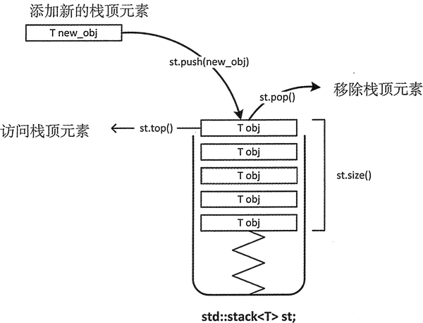
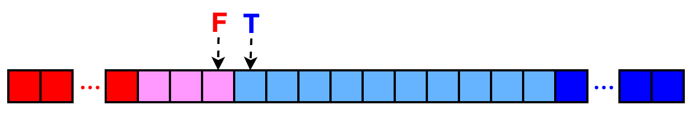
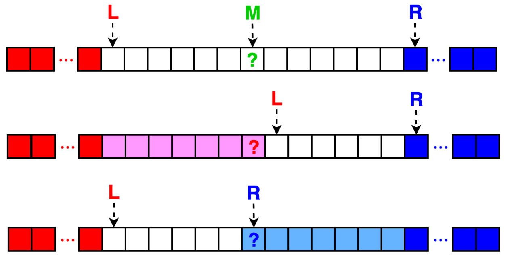

# 算法题-易忘点

## 前言

本文收录我在刷算法题时常用常忘的一些知识点，包含但不限于算法套路、STL使用等。长期更新

## STL使用

### stack



```c++
std::stack<std::string> words;
words.push(std::string("word"));
std::string word = words.top();
words.pop();
int size = words.size();
bool isEmpty = words.empty();
```

### queue


```c++
std::queue<std::string> words;
words.push(std::string("word"));
std::string word=words.front();
word=words.back();
word.pop();
int size = words.size();
bool isEmpty = words.empty();
```

## 二分查找

### lower_bound 和 upper_bound

c++的algorithm头文件

+ lower_bound:找到 **大于等于**目标元素 的下标。找到的是**第一个**可插入的位置，所以是lower。
+ upper_bound:找到 **大于**目标元素 的下标。找到的是**最后一个**可插入的位置，所以是upper。

```c++
sort(vec.begin(),vec.end());//进行二分之前需要排序
int pos = lower_bound(vec.begin(),vec.end()) - vec.begin();  
int num = *upper_bound(vec.begin(),vec.end());
```

### 二分查找的实现

[聊聊一看就会一写就跪的二分查找](https://zhuanlan.zhihu.com/p/343138037)

此文将所有二分查找问题变种抽象为一个基本问题

> 在一个左边全是 false 右边全是 true 的数组中，有且只有一个从 false 突变为 true 的点，二分查找其实就是要找到这个突变点。





```c++
func BSearch(l, r int, f func(int) bool) int {
    for l < r {
        // 注意这里是为了避免溢出
        m := l + (r - l) / 2
        if !f(m) {
            l = m + 1
        } else {
            r = m
        }
    }
    return l
}
```

核心就是想办法把问题转化成基本问题中的布尔数组。

```c++
// 问题: array 非严格递增，返回第一个大于 target 的元素下标。
// 补充: 如果查找不到合法结果，则返回 len(array) 即可。
func FirstGtInAsc(array []string, target string) int {
    return BSearch(0, len(array), func(x int) bool {
        return array[x] > target
    })
}

// 问题: array 非严格递增，返回第一个大于等于 target 的元素下标。
// 补充: 如果查找不到合法结果，则返回 len(array) 即可。
func FirstGteInAsc(array []string, target string) int {
    return BSearch(0, len(array), func(x int) bool {
        return array[x] >= target
    })
}

// 问题: array 非严格递增，返回最后一个小于等于 target 的元素下标。
// 补充: 如果查找不到合法结果，则返回 -1 即可。
func LastLtInAsc(array []string, target string) int {
    return BSearch(0, len(array), func(x int) bool {
        return array[x] > target
    }) - 1
}

// 问题: array 非严格递增，返回最后一个小于 target 的元素下标。
// 补充: 如果查找不到合法结果，则返回 -1 即可。
func LastLteInAsc(array []string, target string) int {
    return BSearch(0, len(array), func(x int) bool {
        return array[x] >= target
    }) - 1
}

// 问题: array 非严格递减，返回第一个小于 target 的元素下标。
// 补充: 如果查找不到合法结果，则返回 len(array) 即可。
func FirstLtInAsc(array []string, target string) int {
    return BSearch(0, len(array), func(x int) bool {
        return array[x] < target
    })
}

// 问题: array 非严格递减，返回第一个小于等于 target 的元素下标。
// 补充: 如果查找不到合法结果，则返回 len(array) 即可。
func FirstLteInAsc(array []string, target string) int {
    return BSearch(0, len(array), func(x int) bool {
        return array[x] <= target
    })
}

// 问题: array 非严格递减，返回最后一个大于等于 target 的元素下标。
// 补充: 如果查找不到合法结果，则返回 -1 即可。
func LastGtInAsc(array []string, target string) int {
    return BSearch(0, len(array), func(x int) bool {
        return array[x] < target
    }) - 1
}

// 问题: array 非严格递减，返回最后一个大于 target 的元素下标。
// 补充: 如果查找不到合法结果，则返回 -1 即可。
func LastGteInAsc(array []string, target string) int {
    return BSearch(0, len(array), func(x int) bool {
        return array[x] <= target
    }) - 1
}
```
